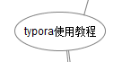

# 这是一个一级标题

## 这是一个二级标题

### 这是一个三级标题

1. 打开冰箱
   1. 插电
   2. 开机
   3. 开门
2. 把大象放进冰箱
3. 关闭冰箱

* 青菜

* 水果

  1. 苹果
  2. 梨子
  3. 菠萝

  * 国产菠萝
  * 进口菠萝

* 肉

| 学号      | 姓名   | 性别 | 年龄 |
| --------- | ------ | ---- | :--: |
| SX2315059 | 邓佳鸿 | 男   |  25  |
|           |        |      |      |

`Java`是一门面向对象的语言

~~~C
#include <stdio.h>

int main(void)
{
    printf("hello world!\n");
    
    return 0;
}
~~~

